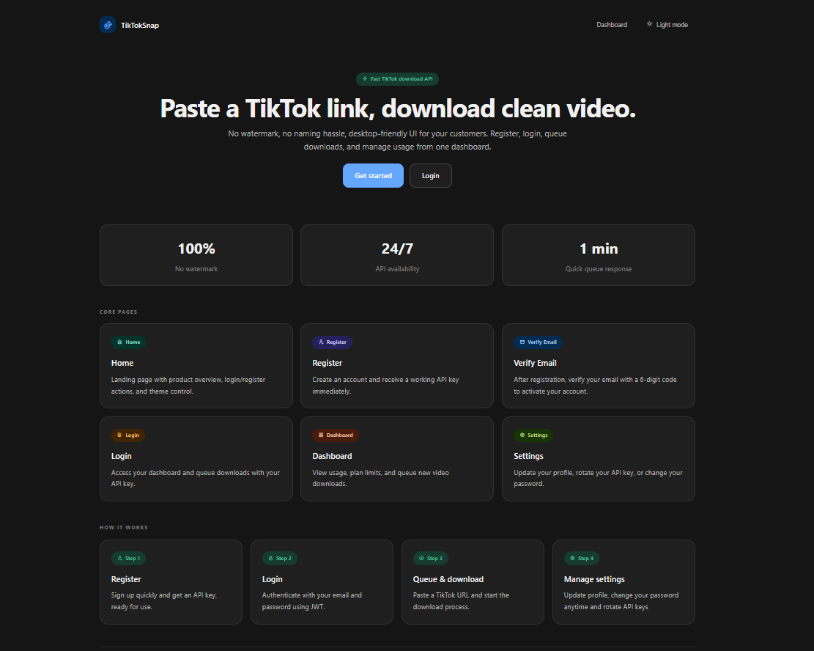
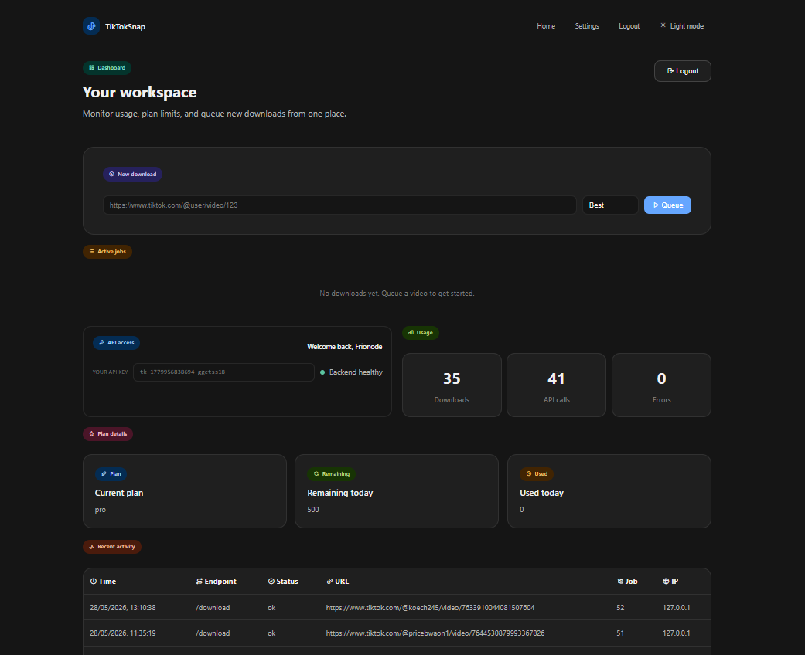
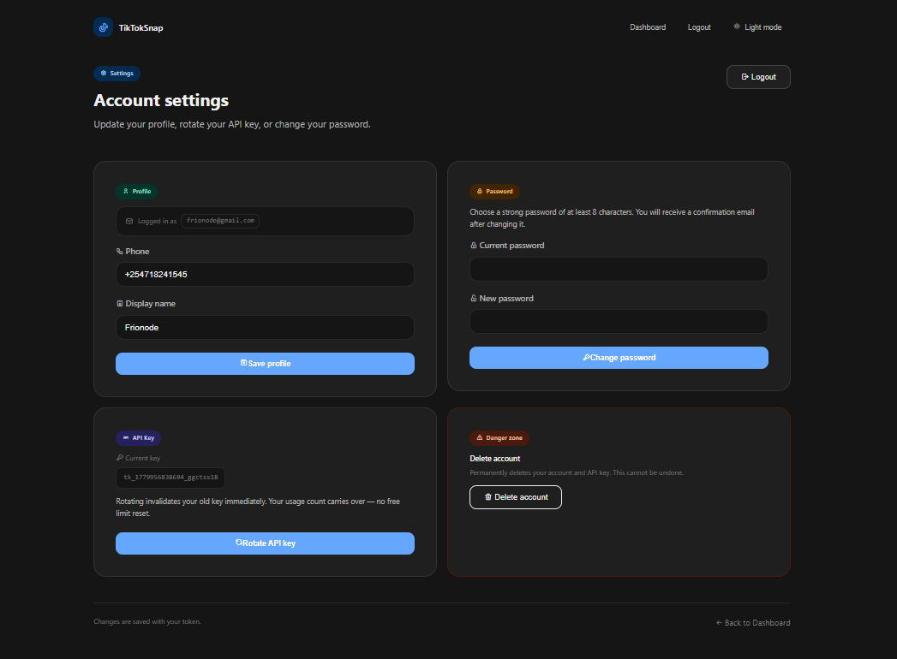

# 🎵 TikTok Downloader API


> **Download TikTok videos and audio without watermarks.** Supports single downloads, MP3 extraction, job queuing, caching, user auth with email verification, and admin controls — built for production use.

---

## 📸 Screenshots

<table>
<tr>
<td align="center">
  
  <br/><sub>Home — Download Interface</sub>
</td>
<td align="center">
  
  <br/><sub>Dashboard — Usage & API Key</sub>
</td>
<td align="center">
  
  <br/><sub>Settings — Profile & Password</sub>
</td>
</tr>
</table>

---

## 📖 How It Works

```
Client Request
      │
      ▼
 Auth Check  ──✗──▶  401 Unauthorized
  (JWT or API Key)
      │
      ▼
 Redis Cache ──hit──▶  Return Cached Response
      │ miss
      ▼
  Bull Queue  (prevents server overload)
      │
      ▼
  yt-dlp  (fetches TikTok video, strips watermark)
      │
      ▼
  ffmpeg  (merges audio + video streams)
      │
      ▼
 File Server ──▶  Client polls /job/:id → /file/:id
      │
      ▼  (after download or 10min timeout)
 Auto Cleanup  (removes temp files)
      │
      ▼
 SQLite  (logs usage per API key)
```

1. **Auth** — public pages are open; API endpoints require `x-api-key`, user endpoints require `Authorization: Bearer <token>`, admin endpoints require `x-admin-key`
2. **Cache check** — same URL recently processed? Returns from Redis instantly
3. **Queue** — new jobs enter a Bull queue backed by Redis, keeping the server stable under load
4. **yt-dlp** fetches the video from TikTok, watermark stripped
5. **ffmpeg** merges the best audio and video into a clean MP4
6. **Job polling** — client polls `GET /job/:id` until complete, then downloads via `GET /file/:id`
7. **Cleanup** runs after download or after a 10-minute timeout fallback
8. **Usage** is logged to SQLite per API key — feeds billing and admin stats

---

## ✨ Features

| Feature | Description |
|---|---|
| 🚫 No Watermark | Clean MP4 output, watermark stripped |
| 🎵 MP3 Extraction | Pull audio-only from any TikTok video |
| ⚡ Redis Caching | Faster repeat requests, saves bandwidth |
| 🔁 Job Queue | Bull + Redis, no server crashes under load |
| 🔑 API Key Auth | Per-key usage tracking, ready for billing |
| 👤 User Auth | Register, email OTP verify, login, JWT sessions |
| 📧 Email via Brevo | OTP verification + password reset emails |
| 🛡 Admin Panel | Manage keys, users, plans, and stats |
| 🧹 Auto Cleanup | Temp files deleted after download or 10min timeout |
| 📊 Usage Tracking | SQLite-backed per-key usage logs |

---

## 🛠 Requirements

| Requirement | Version | Purpose |
|---|---|---|
| [Node.js](https://nodejs.org) | v18+ | Runtime |
| [pnpm](https://pnpm.io) | v8+ | Package manager |
| [Python](https://python.org) | v3.8+ | Required by yt-dlp |
| [yt-dlp](https://github.com/yt-dlp/yt-dlp) | latest | TikTok video fetching |
| [ffmpeg](https://ffmpeg.org) | any | Audio/video merging |
| [Redis](https://redis.io) | v6+ | Queue + caching |
| [Brevo](https://brevo.com) | — | Transactional email (OTP, password reset) |

---

## 🚀 Setup

### 1. Clone the repo
```bash
git clone https://github.com/frionode/TikTokSnap.git
cd TikTokSnap
```

### 2. Install dependencies
```bash
# Node dependencies (uses pnpm)
pnpm install

# yt-dlp
pip install yt-dlp

# ffmpeg
sudo apt install ffmpeg        # Ubuntu/Debian
brew install ffmpeg            # macOS

# Redis
sudo apt install redis-server  # Ubuntu/Debian
brew install redis             # macOS
```

### 3. Configure environment
```bash
cp env.example .env
```

Edit `.env`:
```env
PORT=3000

# Redis
REDIS_HOST=localhost
REDIS_PORT=6379
# REDIS_PASSWORD=your_redis_password   # uncomment if Redis has auth

# Admin
ADMIN_KEY=your_secret_admin_key

# JWT
JWT_SECRET=some_long_random_secret_here

# Frontend
FRONTEND_URL=localhost:3000

# Brevo (transactional email)
BREVO_API_KEY=your_brevo_api_key_here
```

> Get your Brevo API key at [app.brevo.com](https://app.brevo.com) → SMTP & API → API Keys

### 4. Start Redis
```bash
sudo service redis-server start   # Ubuntu
redis-server                      # macOS / manual
```

### 5. Run
```bash
# Development
pnpm dev

# Production
pnpm start
```

Server runs at `http://localhost:3000`

---

## 📡 API Reference

### 🌐 Public Endpoints
No authentication required.

| Method | Path | Description |
|---|---|---|
| GET | `/health` | Server health check |
| GET | `/queue/stats` | Current queue stats |
| GET | `/queue/config` | Queue configuration |

---

### 🔐 Auth Endpoints
No authentication required.

#### `POST /auth/register`
| Parameter | Type | Required | Description |
|---|---|---|---|
| `email` | string | ✅ | Valid email address |
| `password` | string | ✅ | Minimum 8 characters |
| `phone` | string | — | Optional |
| `label` | string | — | Optional display name |

#### `POST /auth/verify-email`
| Parameter | Type | Required | Description |
|---|---|---|---|
| `email` | string | ✅ | Email used at registration |
| `otp` | string | ✅ | 6-digit code from email |

#### `POST /auth/login`
| Parameter | Type | Required | Description |
|---|---|---|---|
| `email` | string | ✅ | — |
| `password` | string | ✅ | — |

#### `POST /auth/reset-password`
| Parameter | Type | Required | Description |
|---|---|---|---|
| `email` | string | ✅ | Sends reset link via Brevo |

#### `POST /auth/set-new-password`
| Parameter | Type | Required | Description |
|---|---|---|---|
| `token` | string | ✅ | JWT token from reset email |
| `new_password` | string | ✅ | Minimum 8 characters |

---

### 👤 User Endpoints
Requires `Authorization: Bearer <token>` header.

| Method | Path | Description |
|---|---|---|
| GET | `/auth/me` | Get current user info |
| POST | `/auth/rotate-key` | Generate a new API key |
| POST | `/auth/change-password` | Change password |
| POST | `/auth/update-profile` | Update phone / label |

#### `POST /auth/change-password`
| Parameter | Type | Required |
|---|---|---|
| `current_password` | string | ✅ |
| `new_password` | string | ✅ (min 8 chars) |

#### `POST /auth/update-profile`
| Parameter | Type | Required |
|---|---|---|
| `phone` | string | — |
| `label` | string | — |

---

### 🎵 API Endpoints
Requires `x-api-key: your-key` header.

| Method | Path | Description |
|---|---|---|
| POST | `/info` | Get video metadata |
| POST | `/download` | Download MP4 (no watermark) |
| POST | `/audio` | Extract MP3 audio |
| GET | `/job/:id` | Poll job status |
| GET | `/file/:id` | Download completed file |
| GET | `/me` | Current API key usage stats |

#### `POST /info`
```json
{ "url": "https://www.tiktok.com/@user/video/123456789" }
```

#### `POST /download`
```json
{
  "url": "https://www.tiktok.com/@user/video/123456789",
  "quality": "best"
}
```
`quality` is optional, defaults to `"best"`.

#### `POST /audio`
```json
{ "url": "https://www.tiktok.com/@user/video/123456789" }
```

#### Job Flow
```bash
# 1. Start a download
POST /download → { "jobId": "abc123" }

# 2. Poll until complete
GET /job/abc123 → { "status": "completed" }

# 3. Download the file
GET /file/abc123 → file stream
```

---

### 🛡 Admin Endpoints
Requires `x-admin-key: your-admin-key` header.

| Method | Path | Description |
|---|---|---|
| GET | `/admin/stats` | Overall platform stats |
| POST | `/admin/keys` | Create a new API key |
| DELETE | `/admin/keys/:key` | Revoke an API key |
| GET | `/admin/users` | List all users |
| POST | `/admin/users/:userId/plan` | Update a user's plan |
| GET | `/admin/plans` | List available plans |

#### `POST /admin/keys`
| Parameter | Type | Required | Description |
|---|---|---|---|
| `label` | string | ✅ | Key identifier |
| `plan` | string | — | Defaults to `"starter"` |

#### `POST /admin/users/:userId/plan`
| Parameter | Type | Required |
|---|---|---|
| `userId` | integer (URL) | ✅ |
| `plan` | string (body) | ✅ |

---

## 📁 Project Structure

```
tiktok-downloader-api/
├── index.js              # App entry point
├── setup/
│   ├── auth.js           # JWT + API key middleware
│   ├── db.js             # SQLite connection (usage.db)
│   ├── mailer.js         # Brevo email (OTP, reset)
│   ├── queue.js          # Bull + Redis queue setup
│   ├── schema.sql        # DB schema
│   └── updater.js        # yt-dlp auto-updater
├── public/               # Frontend (HTML/CSS/JS)
│   ├── index.html
│   ├── dashboard.html
│   ├── settings.html
│   ├── login.html
│   ├── register.html
│   ├── forgot-password.html
│   └── set-new-password.html
├── data/
│   └── usage.db          # SQLite usage database
├── screenshots/
│   ├── home.png
│   ├── dashboard.png
│   └── settings.png
├── env.example
├── Dockerfile
├── pnpm-workspace.yaml
└── package.json
```

---

## 🔄 Keeping yt-dlp Updated

TikTok frequently changes their internals. Run this daily or set a cron:

```bash
pnpm run update-ytdlp
```

**Recommended cron (daily at 2am):**
```bash
0 2 * * * pip install -U yt-dlp >> /var/log/ytdlp-update.log 2>&1
```

---

## ☁️ Deploy

### Docker
```bash
docker build -t tiktok-api .
docker run -p 3000:3000 --env-file .env tiktok-api
```

### Fly.io
```bash
fly launch
fly secrets set ADMIN_KEY=... JWT_SECRET=... BREVO_API_KEY=... REDIS_HOST=...
fly deploy
```

### Railway
```bash
railway init && railway up
```
Add `.env` variables in the Railway dashboard under **Variables**.

---

## ⚠️ Error Reference

| Code | Message | Cause |
|---|---|---|
| 401 | Unauthorized | Missing or invalid API key / token |
| 400 | Invalid URL | Malformed or unsupported TikTok URL |
| 429 | Too many requests | Rate limit hit |
| 500 | Download failed | yt-dlp or ffmpeg error |
| 503 | Queue full | Server under heavy load |

---

## 📬 Contact

Built by **[frionode](https://frionode.online)**

[](https://frionode.online)
[](mailto:frionode@frionode.online)
[](https://github.com/frionode)

---

###### © 2026 frionode · MIT License